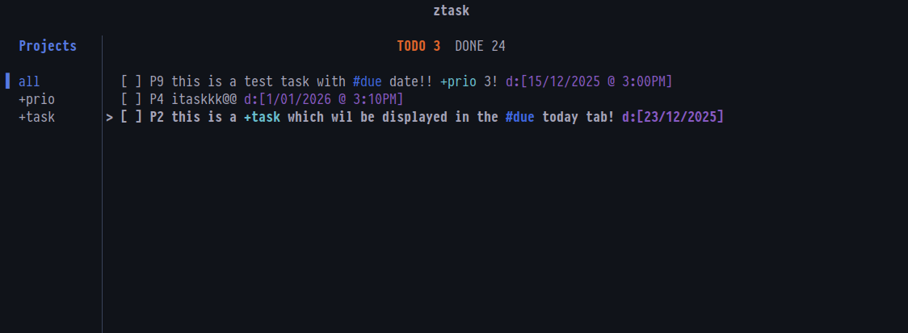

# ztask

[WIP] A minimal, keyboard-driven TUI task manager built with [Zig](https://ziglang.org/) and [libvaxis](https://github.com/rockorager/libvaxis).

Most task management applications suffer from feature bloat, poor keyboard navigation, and unnecessary complexity. **ztask** aims to take a different approach:

- Keyboard-driven: Every operation is accessible via vim-style keybindings
- Low-latency and snappy
- Plain text storage
- Zero cognitive overhead: Simple rules, no complex workflows

## Preview




## Features

- **Three-state task management**: `[ ]` todo → `[@]` ongoing → `[x]` done
- **Project filtering**: Organize tasks with `+project` tags, filter with a sidebar
- **Context tagging**: Add `#context` markers for categorization
- **Priority ranking**: Numeric priorities (0-255) with visual indicators
- **Due dates & times**: Flexible date/time parsing with configurable display formats
- **Repeating tasks**: Auto-resurrect completed tasks on intervals (minutes/hours/days/weeks/years)
- **Due today view**: Dedicated screen for tasks due today, sorted by priority
- **Undo/redo**: Single-level undo for destructive operations
- **Vim navigation**: `hjkl`, `gg/G`, tab switching, and more
- **Wrapped text rendering**: Long task descriptions wrap intelligently in the terminal
- **Customizable date formats**: Configure how dates and times display via a simple config file

## Installation

### Prerequisites

- Zig 0.13.0 or later
- A terminal with basic ANSI support

### Build from source

```bash
git clone https://github.com/yourusername/ztask
cd ztask
zig build -Doptimize=ReleaseFast
```

The binary will be available at `zig-out/bin/ztask`.

### Install

```bash
# Copy to your PATH
sudo cp zig-out/bin/ztask /usr/local/bin/
```

## Quick Start

Launch ztask:

```bash
ztask
```

### Basic workflow

1. Press `:n` to create a new task
2. Type your task description, optionally add `+project` and `#context` tags
3. Press `Esc` then `:w` to save
4. Navigate with `j`/`k`, toggle done with `X`, delete with `D`

### Task syntax

Tasks support inline metadata:

```
Buy groceries +personal #errands
Review PR #312 +work priority:5 due:2025-01-25 15:00
Weekly report +work repeat:1w due:friday
```

## Keybindings

### Main view

| Key       | Action                             |
| --------- | ---------------------------------- |
| `j` / `k` | Move selection down/up             |
| `↓` / `↑` | Move selection down/up             |
| `gg`      | Jump to first task                 |
| `G`       | Jump to last task                  |
| `Tab`     | Switch between TODO and DONE lists |
| `H`       | Focus TODO list                    |
| `L`       | Focus DONE list                    |
| `p`       | Toggle project sidebar             |
| `d`       | Open "due today" view              |
| `X`       | Toggle task done/undone            |
| `@`       | Toggle task ongoing status         |
| `D`       | Delete selected task               |
| `u`       | Undo last operation                |
| `:n`      | New task                           |
| `:e`      | Edit selected task                 |
| `:d`      | Mark selected task done            |
| `Ctrl-C`  | Quit                               |

### Project sidebar

| Key       | Action                           |
| --------- | -------------------------------- |
| `p`       | Toggle sidebar                   |
| `j` / `k` | Navigate projects (when focused) |

### Editor view

| Key   | Action                                                        |
| ----- | ------------------------------------------------------------- |
| `i`   | Enter insert mode                                             |
| `Esc` | Return to normal mode                                         |
| `Tab` | Cycle through fields (task/priority/due date/due time/repeat) |
| `:w`  | Save and exit                                                 |
| `:q`  | Quit without saving                                           |
| `:wq` | Save and exit                                                 |
| `:t`  | Jump to task field                                            |
| `:p`  | Jump to priority field                                        |
| `:d`  | Jump to due date field                                        |
| `:r`  | Jump to repeat field                                          |

### Due today view

| Key         | Action              |
| ----------- | ------------------- |
| `d` / `Esc` | Return to main view |
| `j` / `k`   | Navigate tasks      |
| `X`         | Mark task done      |
| `@`         | Toggle ongoing      |
| `D`         | Delete task         |

## Task Properties

### Priority

Set numeric priorities (0-255). Higher numbers = higher priority.

```
:n
High priority bug +work
priority: 9
```

### Due dates

Flexible date parsing:

- ISO format: `2025-01-25`
- Slash format: `25/1/2025`, `25/1/25`
- Dash format: `25-1-2025`

### Due times

Multiple time formats supported:

- 24-hour: `15:30`, `1530`
- 12-hour: `3:30pm`, `3pm`, `3 PM`

### Repeat intervals

Auto-resurrect tasks after completion:

- `2d` - every 2 days
- `1w` - every week
- `3h` - every 3 hours
- `30m` - every 30 minutes
- `1y` - every year

Full words also work: `2 days`, `1 week`, `3 hours`

## Configuration

Configuration file location:

- **Linux**: `~/.config/ztask/conf`

### Date/time format customization

```ini
# Display format for due dates (strftime-style)
due_date = "%d/%m/%Y"  # UK format: 25/01/2025
# due_date = "%x"      # ISO format: 2025-01-25 (default)
# due_date = "%b %d"   # Short: Jan 25

# Display format for due times
due_time = "%-I:%M%p"  # 12-hour: 3:30PM
# due_time = "%H:%M"   # 24-hour: 15:30 (default)

# Template for combining date and time in task list
due = "date time"      # "Jan 25 3:30PM"
# due = "{date}"       # Date only
# due = "📅 {date}"    # With emoji

# Editor input format (strict parsing)
editor_due_date = "%d/%m/%Y"  # Only accept UK format in editor
# editor_due_date = ""         # Accept flexible formats (default)
```

### Format specifiers

| Code  | Description       | Example    |
| ----- | ----------------- | ---------- |
| `%Y`  | 4-digit year      | 2025       |
| `%y`  | 2-digit year      | 25         |
| `%m`  | Month (padded)    | 01         |
| `%-m` | Month (no pad)    | 1          |
| `%d`  | Day (padded)      | 05         |
| `%-d` | Day (no pad)      | 5          |
| `%b`  | Month abbr        | Jan        |
| `%B`  | Month full        | January    |
| `%H`  | Hour 24h (padded) | 15         |
| `%-H` | Hour 24h (no pad) | 3          |
| `%I`  | Hour 12h (padded) | 03         |
| `%-I` | Hour 12h (no pad) | 3          |
| `%M`  | Minute (padded)   | 05         |
| `%p`  | AM/PM             | PM         |
| `%x`  | ISO date          | 2025-01-25 |
| `%X`  | ISO time          | 15:30      |
